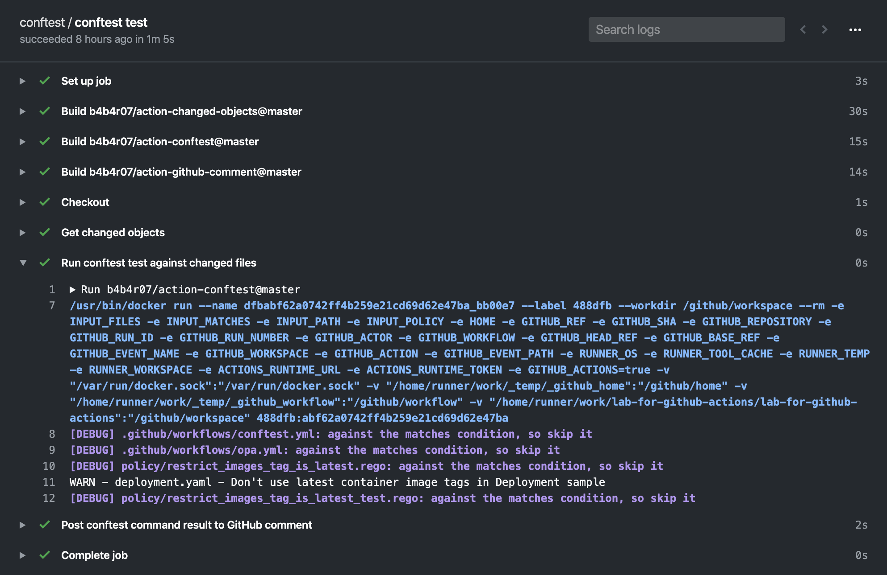

action-conftest
===============

[](https://github.com/b4b4r07/action-conftest/releases)



Run [conftest test](https://github.com/instrumenta/conftest) command with GitHub Actions

You can use the fixed version from: [Releases](https://github.com/b4b4r07/action-conftest/releases/latest)

## Usage

A whole example is here:

```yaml
name: conftest

on: [pull_request]

jobs:
  conftest:
    name: conftest test
    runs-on: ubuntu-latest
    steps:
    - name: Checkout
      uses: actions/checkout@v1
    - name: Get changed objects
      uses: b4b4r07/action-changed-objects@master
      with:
        added: 'true'
        deleted: 'false'
        modified: 'true'
      id: objects
    - name: Run conftest test against changed files
      uses: b4b4r07/action-conftest@master
      if: steps.objects.outputs.changed
      with:
        files: ${{ steps.objects.outputs.changed }}
        matches: '*.yaml'
      id: conftest
    - name: Post conftest command result to GitHub comment
      uses: b4b4r07/action-github-comment@master
      if: steps.conftest.outputs.result
      with:
        body: |
          ## conftest test result
          ```
          ${{ steps.conftest.outputs.result }}
          ```
      env:
        GITHUB_TOKEN: ${{ secrets.GITHUB_TOKEN }}
        LOG: trace
```

If you want to run [conftest](https://github.com/instrumenta/conftest) command against only changed config files, you need to use [b4b4r07/action-changed-objects](https://github.com/b4b4r07/action-changed-objects) to get the changed files in Git commit. It defaults to compare with checkout-ed branch and origin/master branch.

In addition, you can filter the changed files, for example, let's say you want to test only changed JSON and YAML files:

```yaml
      with:
        files: ${{ steps.objects.outputs.changed }}
        matches: '*.json manifests/*.yaml'
```

Besides, if you want to post the `conftest test` command result on your pull requests, you need to set the step `Post conftest command result to GitHub comment`. The contents of `body` is the message itself. You can configure it as Markdown. For more details, please see also [b4b4r07/action-github-comment](https://github.com/b4b4r07/action-github-comment).


## Customizing

### inputs

The following are optional as `step.with` keys

| Name       | Type   | Description                                                               | Default |
| ---------- | ------ | ------------------------------------------------------------------------- | ------- |
| `path`     | String | Path to directory where config files are located                          | `.`     |
| `policy`   | String | Path to the Rego policy files directory                                   | `policy`|
| `files`    | String | A list of config file to be tested by conftest. Separated by a space      |         |
| `matches`  | String | A list of cases to be tested (e.g. "*.yaml *.json"). Separated by a space |         |

When providing a `path` and `files` at the same time, `files` will be attempted first, then falling back on `path` if the files can not be got from.

### outputs

The following outputs can be accessed via `${{ steps.<step-id>.outputs }}` from this action

| Name     | Type   | Description                   |
| -------- | ------ | ----------------------------- |
| `result` | String | Outputs of `conftest` command |

### environment variables

The following are as `step.env` keys

| Name | Description |
| ---- | ----------- |
| n/a  | n/a         |

## License

[MIT](https://b4b4r07.mit-license.org/)
